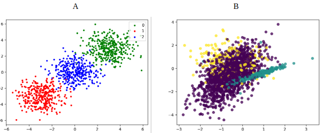

# SIMULADO DE PROVA

## APRENDIZADO DE MÁQUINA SUPERVISIONADO

#### Conceitos Gerais

- O que é o aprendizado de máquina supervisionado?

- O que é aprendizado não-supervisionado?

- O que são atributos e classes?

- De um exemplo de uma instância (amostra) de um problema de classificação qualquer. Por exemplo, como você classificaria carros? E cães e gatos?

- O que significa a anotação dos dados?

- O que significa representativade em termos de características ?

- Dado o dataset abaixo, determine o que são atributos e o que são classes (target):

- Quais etapas possui um fluxo (pipeline) de aprendizado de máquina?   

- O que é classificação binária e multi-classes?

- Como abordar classificação multi-classes a partir de modelos binários?

- Diferencie a técnica One vs One e One vs All

#### Análise Exploratória

- O que significa a análise exploratória dos dados? O que desejamos verificar com isso

- O que são dados categóricos e dados númericos?

- Como converto um dado categórico em númerico? De um exemplo.

- Considerando o dataset de veículos acima, converta o atributo 'Cor' em númerico utilizando a técnica "one hot enconding".

- O que é um dataset desbalanceado? O desbalanceamento ocorre em termos de atributos ou classes?

- Que técnicas podem minimizar o impacto de dados desbalanceados? Quando utiliza-las? 

- Na técnica Oversampling, o que significa interpolar as amostras? Ilustre um exemplo

- Análisando as distribuições abaixo (A e B):
  
  - Qual aprensenta as fronteiras decisão mais definidas? Justifique sua resposta
  
  - Qual apresenta desbalanceamento de classes? Justifique sua resposta

- 

        

- O que é a normalização de atributos? Porque isso é importante? Normalize as features abaixo por minmax():
  
  <img title="" src="" alt="How to Scale data into the 0-1 range using Min-Max Normalization. -  Knowledge Transfer" data-align="center" width="293">

- O que é a redução de atributos e quando devemos aplicá-la?

- O que significa a correlação de atributos? Dê exemplos.

- O que faz o algoritmo PCA? 

- Como interpretar o grafico da variância (PCA) abaixo? 

#### Algoritmo KNN

- Descreva em poucas linhas o algoritmo KNN. Se preferir, faça um desenho auxiliar e explique.

- O KNN funciona somente para 2 classes (binário) ? 

- Qual a desvantagem do KNN em datasets grandes ? Por exemplo, com 100 mil amostras e 2000 atributos?

- O KNN reduz o espaço de características? E o espaço de busca? Justifique.

- O que é o parametro K, do KNN? Como ele impacta na classificação? Justifique.

- Analisando as seguintes distribuições, em qual o algoritmo KNN deve performar melhor? Porque? 
  
  - Qual o impacto de um K maior e menor em cada uma das distribuições?   

- Qual a classe da amostra de teste para K=3 e K=5, abaixo?
  
  

  Considere o seguinte dataset e a amostra de teste abaixo:

      Utilizando a distância Euclidiana abaixo, qual o resultado da amostra para K=1 e K=3?

#### Algoritmo Naive Bayes

- Explique de maneira sucinta como funciona o Naive Bayes?

- Explique sucintamente o teorema de bayes. Cite exemplos.

- O que é uma probabilidade a posteriori e a priori? Como isso é aplicado no Naive Bayes?

- Dado dataset de frutas abaixo:

  Aplique o algoritmo Naive Bayes para determinar a probalidade e classes das amostras abaixo:

- Como aplicar o modelo Naive Bayes datasets com  atributos númericos, tais como como peso, altura, salario, etc? De exemplos.

#### Algoritmo Decision Tree

- Explique com suas palavras o algoritmo de árvore de decisão. Ilustre um exemplo

- O que é a entropia, probabilidade e ganho de informação?

- O que o ganho de informação representa para este algoritmo?

- Considerando o dataset de frutas acima, calcule a entropia e o ganho de informação para a característica 'Tamanho'.

#### Análise Crítica

- Analisando as fronteiras de decisão, o que se pode infererir quanto a generalização do modelo? Quais classes devem sofrer perdas de acurácia e porque?

        Modelo A

     Modelo B

       

    Modelo C

- O que determinas as métricas de acurácia e recall?

- Porque a acurácia geral não é uma boa métrica? Dê um exemplo.

- Calcule a acurácia do modelo a partir da matriz de confusão abaixo:

- Dados as matrizes de confusão abaixo, análise os casos individualmente quanto:
  
  - Qual a acurácia global ?
    
    O modelo está bem ajustado ou existe overfitting?
    
    O dataset pode ser considerado balanceado?
    
    Caso A:
    
    
    
    Caso B
    
    

             Caso C:

   

            Caso D:

