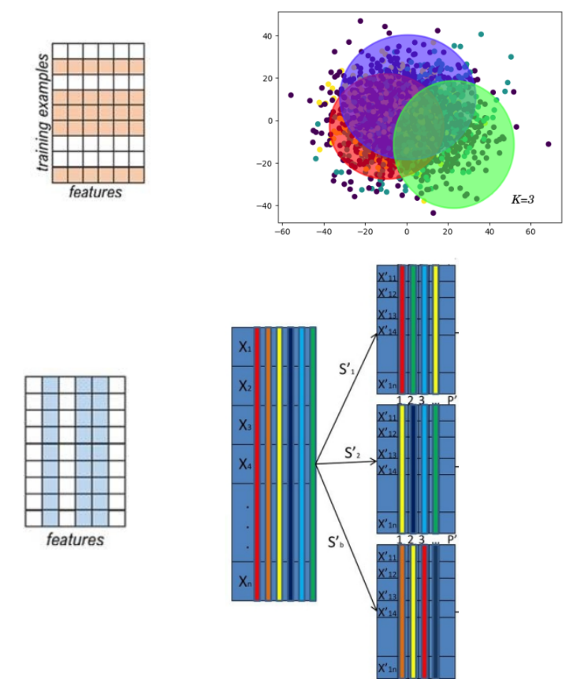
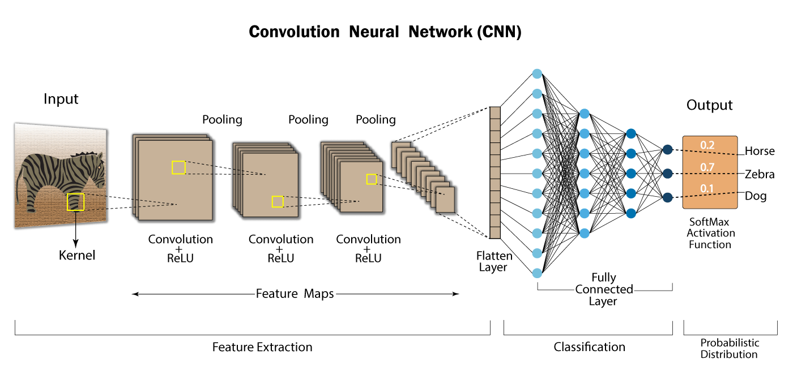

# SIMULADO DE PROVA

A seguir é apresentado uma série de questões para nortear o estudo. 

No caso de algumas figuras não aparecerem, opte pela opção em *pdf*

## APRENDIZADO DE MÁQUINA NÃO-SUPERVISIONADO

1. Quais são as principais diferenças entre aprendizado supervisionado e não supervisionado?

2. O que é clustering e qual é o objetivo principal dessa técnica de aprendizado de máquina não supervisionado?

3. Descreva o algoritmo k-means e explique como ele funciona para realizar o clustering. 

4. Apresente um pseudo-código do K-Means

5. Como o K-Means inicializa e atualiza os centróides?

6. Em que momento o K-means determina o fim do ajuste dos centróides?

7. Como determinar o valor de K ?

8. O que é Inértia?

9. O que é coesão e separação? Como cálcular eles?

10. O que é a análise Elbow?

11. Um valor de K muito alto, terá qual impacto no K-Means?

12. O que é o Índice Silhoueta e como utilizá-lo?

13. O que significa um índice silhoueta -1,0 e 1?

14. Quais são as métricas de avaliação comumente utilizadas para medir a qualidade dos clusters gerados por um algoritmo de clustering?
    
    O que você pode discutir sobre os resultados abaixo?
    
    

## Agrupamentos ou Conjuntos (Ensembles)

1. O que é Bagging e como ele funciona? Descreva as etapas principais envolvidas no algoritmo de Bagging.

2. Em nível de instâncias e atributos, como gerar diversidade a partir de uma mesmo dataset?

3. Qual é o objetivo do uso da amostragem de bootstrap no Bagging? Como isso ajuda a melhorar o desempenho do conjunto?

4. Qual a técnica de re-amostragem ilustradas pela figuras abaixo:
   
   
   
   

5. Como o Random Forest gera diversidade? É possível gerar diversidade a nível de nodo da sub-árvore ?

6. O que é Boosting e como ele funciona? Explique a ideia de adicionar iterativamente aprendizes fracos para criar um aprendiz forte no Boosting.

7. Qual é a principal diferença entre Bagging e Boosting em termos de como os aprendizes base são treinados e combinados?

8. Descreva o algoritmo Random Forest. Como ele difere de uma única árvore de decisão?

9. Descreva o algoritmo AdaBoost, uma implementação popular do Boosting. Como ele atribui pesos às amostras de treinamento para focar nas instâncias classificadas incorretamente?

10. Quais são alguns aprendizes fracos comumente usados em algoritmos de Boosting? Como eles contribuem para o desempenho geral do conjunto?

11. Explique o conceito de Boosting com reamostragem. Como isso lida com instâncias difíceis de classificar no conjunto de treinamento?

12. Compare e contraste Bagging e Boosting em termos de sua abordagem para reduzir o viés e a variância no modelo de conjunto.

13. O que é a seleção dinâmica de classificadores? 

14. O que é um meta-classifier? Como ele se comporta nas técnicas de seleção dinâmica e stacking?

15. Quais são os atributos e classes do meta classifier em ambas abordagens?

## Deep Learning

1. O que é o Deep Learning e qual é a diferença em relação a outros métodos de aprendizado de máquina?
2. Quais são os principais desafios enfrentados pelo Deep Learning? (Base, Custo Computacional, Ajuste dos Dados)
3. O que é uma rede neural convolucional (CNN) e em que tipo de problema ela é comumente aplicada?
4. Cite as duas principais etapas de uma cnn? 
5. Explique o conceito de transferência de aprendizado (transfer learning) e como ele é usado em redes neurais profundas.
6. Quais são os principais métodos para evitar overfitting em redes neurais profundas?
7. O que significa camadas convolucionais?
8. O que é uma camada de pooling?
9. O que significa congelar os pesos? 
10. Podemos usar uma CNN para extrair características? Porque as características são chamadas de profundas?

## Redes Neurais Recorrentes

1. O que significa o termo recorrente nesse tipo de rede? 
2. O que é recorrente, o dado ou o modelo?
3. Como que tipo de dado essas redes comumente trabalham, e como ele é representado?
4. A classificação é estática ou dependente dos estados anteriores?
5. Qual a diferença básica dos modelos recorrentes para os modelos 'estáticos'?
6. Explique o conceito de memória de curto prazo (short-term memory) em uma Rede Neural Recorrente (RNN) e por que isso é importante para o processamento de sequências.
7. Quais são os principais desafios enfrentados pelas RNNs em relação ao desvanecimento do gradiente (vanishing gradient) e como eles podem ser mitigados?
8. Descreva o funcionamento básico de uma célula de memória Long Short-Term Memory (LSTM) 
9. O que é o problema da dependência de longo prazo (long-term dependency problem) e como as RNNs podem ajudar a lidar com ele?
10. Como as RNNs podem ser aplicadas em tarefas de previsão de séries temporais?
11. As RNNs podem ser aplicadas na geração de texto ou sequências, como em modelos de linguagem.

## Casos de Uso

Nos casos a seguir, apresente uma solução para o problema, detalhando brevemente quais dados devem ser coletados, como eles podem ser representados e qual modelo de machine learning é mais adequado.

- Um engenheiro agrônomo precisa prever a quantidade de chuvas nas próximas semanas para garantir que sua plantação recém-estabelecida não fique sem água por mais de 20 dias. Considerando que ele não tem conhecimentos em Machine Learning, que tipo de dado ele pode coletar e qual modelo/abordagem é mais indicado?

- Um engenheiro civil precisa realizar a classificação de imagens para identificar fissuras estruturais em edificações. Ele já dispõe de uma base contendo alguns tipos de rachaduras. Proponha uma solução de machine learning.

- Uma empresa de ônibus percebeu que algumas rotas aumentaram o número de atrasos devido ao aumento do tráfego. Sabendo que ela deseja alterar alguns horários de partida, proponha uma abordagem de machine learning.

- Uma empresa do ramo da aviação possui uma base de ordens de serviço de manutenções em aeronaves. No entanto, ela precisa saber quais os problemas mais comuns, uma vez que não tem nenhum detalhamento sobre isso. Como você abordaria esse problema com machine learning?

- Uma empresa aduaneira precisa controlar a entrada e saída de caminhões no porto. Basicamente, ela precisa registrar quando um caminhão transporta mais de um contêiner. Um funcionário sugeriu usar a câmera de segurança para fazer isso. Como você abordaria esse problema?

- Uma empresa de telemarketing precisa encontrar potenciais clientes através de uma base de dados com diversas características de gostos e compras. O que você recomenda?

- Uma empresa automobilística produz carros com vários sensores que geram diversos dados ao longo do tempo. Ela deseja implementar inteligência artificial no computador de bordo para antecipar possíveis falhas utilizando os dados destes sensores. O que você recomendaria?
